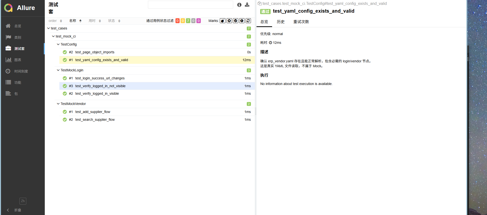

# QA Playground — 王贺龙的测试开发技术仓库

> 2.5 年测试开发经验 · Python 自动化 · Jenkins CI/CD · Allure 可视化报告 · AI 辅助测试

[](https://github.com/wyf200129-oss/qa-playground)
[](https://github.com/wyf200129-oss/qa-playground)
[](https://github.com/wyf200129-oss/qa-playground)
[](https://github.com/wyf200129-oss/qa-playground)
[](https://github.com/wyf200129-oss/qa-playground)

---

## 关于我

财务管理专业出身，在校期间主动转型软件测试，毕业即拿到测试开发 Offer。

目前具备 **2.5 年 Web/App 双端测试开发经验**，擅长接口自动化与 UI 自动化框架搭建，基于 Cursor .cursorrules 定制 POM 截图驱动自动化流水线，在国内较早探索并落地 AI 辅助测试方案，取得了 **用例设计工时缩短 50%、需求场景覆盖率由 80% 提升至 95%** 的实际效果。

**期望城市：大连** | 📧 346296043@qq.com | 📱 18840823821

---

## 技术栈

| 类别 | 技能 |
|------|------|
| **语言** | Python |
| **UI 自动化** | Selenium · POM 设计模式 · YAML 数据驱动 · Cursor 截图驱动流水线 |
| **接口自动化** | Requests · 关键字驱动 · JSONPath · pytest-allure |
| **CI/CD** | Jenkins Pipeline · Allure Report 插件 · Git SCM |
| **性能测试** | JMeter · TPS / 95线 / 错误率分析 |
| **App 测试** | adb 调试 · Monkey 稳定性测试 · Fiddler 抓包 |
| **数据库** | MySQL 多表联查 |
| **工具链** | Git · Docker · Linux Shell · 禅道 · Cursor AI · .cursorrules |

---

## 仓库结构

```
qa-playground/
├── automation-demos/
│   ├── ui-pom/          # 🖥️  POM + YAML UI 自动化框架（Selenium + pytest）
│   └── api-keyword/     # 🔌  关键字驱动接口自动化框架（Requests + pytest）
├── .cursor/             # 🎯  Cursor 截图驱动流水线（5条规则 + 1个 Skill）
├── ai-testing/          # 🤖  AI 辅助测试工作流与实践
├── ci/                  # 🐳  Docker 相关配置
└── Jenkinsfile          # 🚀  Jenkins Pipeline（4 个 Stage，含 Allure Report）
```

---

## Jenkins CI/CD Pipeline

**4 个 Stage 全程自动化，推代码即触发构建：**

```
Env Check  →  Install Dependencies  →  Run POM Tests  →  Allure Report
   ✅                ✅                      ✅                ✅
```

**最新一次构建结果：7 passed in 0.06s ✅**

```
test_cases/test_mock_ci.py::TestMockLogin::test_login_success_url_changes    PASSED
test_cases/test_mock_ci.py::TestMockLogin::test_verify_logged_in_visible     PASSED
test_cases/test_mock_ci.py::TestMockLogin::test_verify_logged_in_not_visible PASSED
test_cases/test_mock_ci.py::TestMockVendor::test_add_supplier_flow           PASSED
test_cases/test_mock_ci.py::TestMockVendor::test_search_supplier_flow        PASSED
test_cases/test_mock_ci.py::TestConfig::test_yaml_config_exists_and_valid    PASSED
test_cases/test_mock_ci.py::TestConfig::test_page_object_imports             PASSED
```

> 演示用例采用全流程 Mock，不依赖任何真实后端，任何人 clone 后可直接 `Build Now` 复现全绿结果。

### Allure 测试报告预览



### 快速复现

1. Fork 本仓库
2. Jenkins 新建 Pipeline，选 **Pipeline script from SCM**，填入仓库地址
3. 点击 **Build Now**，约 2 分钟全绿（第二次因 `.venv` 复用更快）

**环境要求：** Python 3.x · Jenkins 2.x · Allure Jenkins Plugin · Git

---

## UI 自动化框架 — POM + YAML + Cursor 截图驱动流水线

**路径：`automation-demos/ui-pom/`**

基于 Page Object Model 的多层分离架构，覆盖 ERP 销售、采购、仓库三大模块（12 类核心单据），累计 200+ 条 UI 自动化用例。

### 架构分层

| 层 | 职责 |
|----|------|
| `base_page/` | Selenium 原子操作封装：定位、输入、点击、显式等待、断言 |
| `page_object/` | 页面业务对象：登录、采购、销售、仓库、人员、供应商 |
| `test_cases/` | 用例编排与 Pytest 断言 |
| `test_data/` + `validate/` | 测试数据双文件分离（正式数据 + 自检验证），幂等递增 |
| `conf/` | 配置管理（Server 连接、YAML 加载、Options） |
| `scripts/` | 工具脚本（自检、数据递增 bump） |
| `utils/` | 位置策略、元素修复、失败缓存、浏览器封装 |

### 核心亮点

**✅ Cursor .cursorrules 截图驱动全自动化流水线**

5 条规则 + 1 个 Skill，实现「截图 → 页面对象 → 自检 → 用例 → pytest → Allure → 幂等」一键式流程：

| 规则/技能 | 功能 | 核心机制 |
|:---|:---|:---|
| `pom-page-object` | 页面对象编写规范 | 继承 BasePage、定位器优先级 id>name>css>xpath |
| `pom-locator-repair` | 定位器自愈修复 | 失败后自动分析 DOM → 替换定位器 → 重试（≤3次） |
| `pom-pipeline-gate` | 12 步流水线门禁 | 一步失败即停，禁止静默跳过 |
| `pom-test-data` | 数据双分离 | validate/ 自检数据与正式数据独立，pytest 后幂等递增 |
| `pom-todo-progress` | Todo 驱动执行 | 全流程任务面板可见，一步 in_progress → completed |
| `pom-screenshot-pipeline` (Skill) | 截图一键流水线 | 12 步：analyze → code-scan → page-object → ... → allure-report |

**✅ 显式等待替代 sleep — 快 3 倍，消除假阳性**
```python
self.wait_for_url_change(self.url, timeout=20)         # 登录后 URL 跳转
self.wait_for_invisible(*self.vendor_modal, timeout=10)  # 弹窗关闭
```

**✅ YAML 数据驱动，测试数据与代码完全分离**
```yaml
login:
  user: "[ERP测试账号]"
  pwd:  "[ERP测试密码]"
sale_order:
  customer: "[客户名称]"
  product: "[商品编码]"
```

**✅ 元素定位失败修复缓存**
```python
# 定位失败 → 自动尝试 id → name → css → xpath → 缓存修复记录 → 超 3 次等待人工
from utils.locator_failure_cache import LocatorFailureCache
from utils.element_repair import repair_locator
```

[→ 查看详细文档](./automation-demos/ui-pom/README.md)

---

## 接口自动化框架 — 关键字驱动

**路径：`automation-demos/api-keyword/`**

基于 Requests 封装的关键字驱动接口框架，支持多环境一键切换、Token 自动注入、Allure 报告。

### 设计亮点

| 特性 | 说明 |
|------|------|
| 关键字驱动 | YAML 定义用例数据，`api.request(**data)` 执行，数据与代码分离 |
| 多环境切换 | `@pytest.mark.parametrize('set_env', ['Test_Env'], indirect=True)` 一行切换 |
| Token 自动注入 | 登录后 token 写入 ini，后续请求自动带 `Authorization` 头 |
| JSONPath 提取 | `api.get_text(res.json(), 'token')` 支持 `$..key` 递归搜索 |
| Allure 报告 | `@allure.epic/feature/story/step` 全链路标注 |
| 自动清理 | `clear_token` fixture 在用例结束后自动清空缓存 |

[→ 查看详细文档](./automation-demos/api-keyword/README.md)

---

## AI 辅助测试实践

**路径：`ai-testing/`**

在实际项目中探索并落地 AI 辅助测试设计，量化效果如下：

| 指标 | 优化前 | 优化后 | 变化 |
|------|--------|--------|------|
| 用例设计工时 | 基准值 | — | **减少约 50%** |
| 需求场景覆盖率 | 80% | 95% | **↑ 15 个百分点** |

**工作流：**
```
业务需求文档
    → AI 解析需求要点（Prompt Engineering）
    → AI 生成测试场景草稿
    → 人工评审 + 补充边界 & 异常路径
    → 代码化 → 纳入 Jenkins 自动回归
```

[→ 查看完整工作流](./ai-testing/workflow.md)

---

## 项目经历

### ERP 企业资源计划系统（2025.05 – 2026.03）
面向服装企业的 Web + App 双端进销存系统，覆盖 13 个业务模块。

- 主导采购/销售/库存三模块全流程测试，覆盖 12 类核心单据
- 独立搭建 POM UI 自动化（200+ 条用例）+ 关键字驱动接口自动化（400+ 条用例）双框架，接入 Jenkins 定时回归
- 基于 Cursor .cursorrules 定制 POM 截图驱动自动化流水线，实现定位器自愈修复与流水线门禁
- 探索并落地 AI 大模型（ChatGPT/Kimi）+ RAG 辅助测试设计，用例设计工时缩短 50%

### CCAS 后台管理系统（2024.10 – 2025.04）
电子档案编制管理系统，支持多层级归档、CA 数字证书电子签章。

- 独立完成功能测试与接口/压力测试
- 保障电子档案与纸质档案数据一致性，实现跨档案类型数据稽核

---

## 联系方式

- 📧 邮箱：346296043@qq.com
- 📱 电话：18840823821
- 🐙 GitHub：[github.com/wyf200129-oss](https://github.com/wyf200129-oss)

---

> 💡 **"不只会用工具，更会从 0 到 1 搭建工具。"**
>
> 欢迎技术交流，大连地区的 HR 和猎头也欢迎直接联系。
